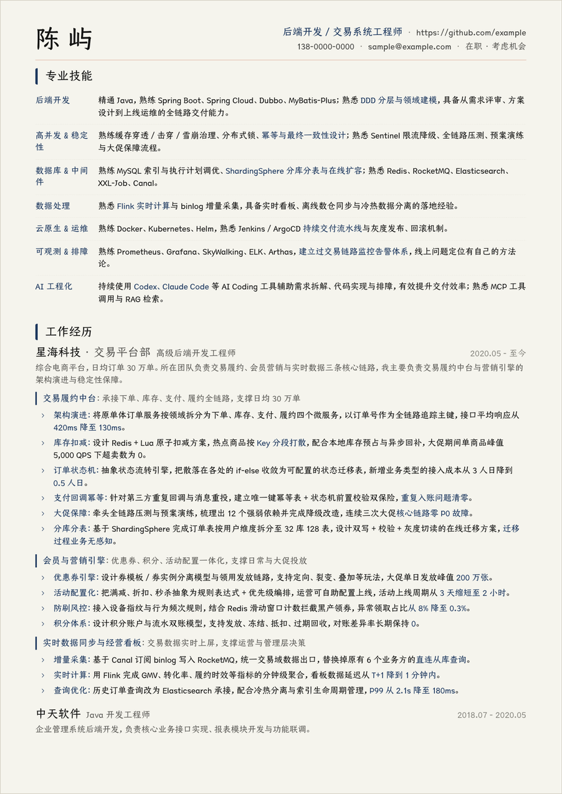
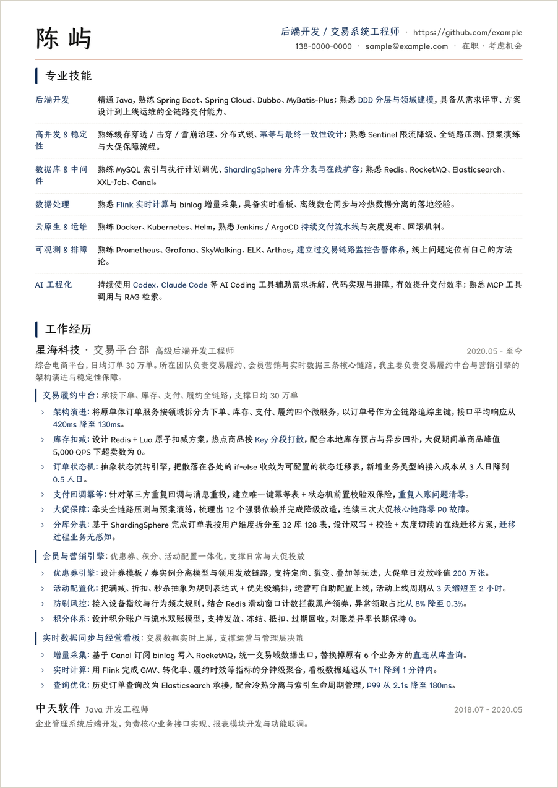
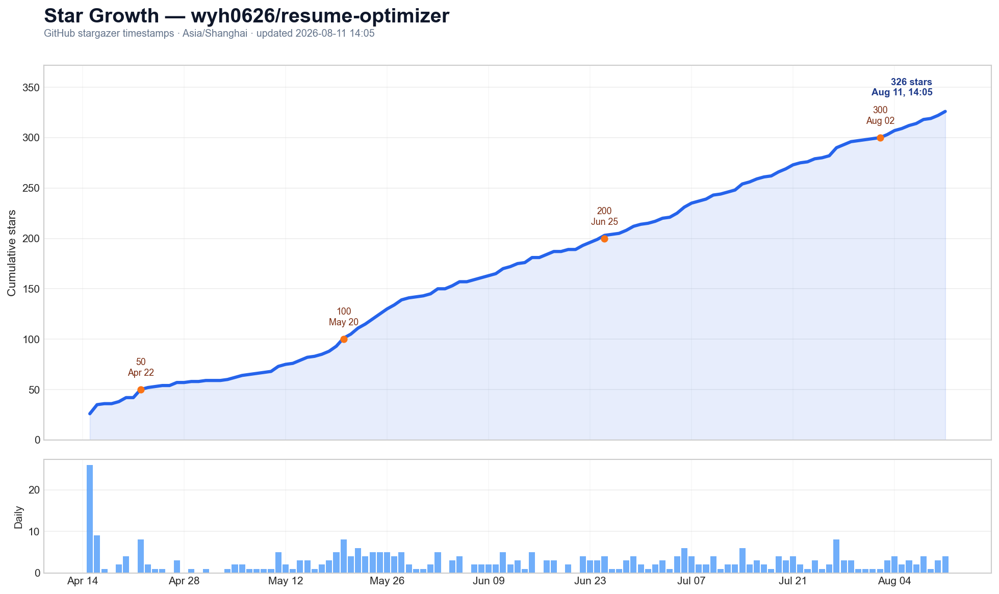

# Resume Optimizer

[](https://github.com/wyh0626/resume-optimizer/stargazers)
[](https://skills.sh/wyh0626/resume-optimizer)

一个面向求职者的简历优化 Skill。

它专注做一件事：把普通、松散、偏职责型的简历，审计并重写成更有说服力的求职材料，方便你单独开源、维护和分发。

## 这个项目解决什么问题

- 帮你找出简历里最致命的问题，而不是泛泛而谈
- 把“负责了什么”改成“做成了什么”
- 主动挖出量化结果、业务价值和实际交付产物
- 根据目标 JD 调整关键词、项目重点和职业叙事
- 生成一版可继续打磨的改写稿
- 在用户需要时生成一份压缩后的一页简历
- 识别外包经历、玩具项目、量化缺失、技术表述失真等常见风险

## 项目结构

```text
resume-optimizer/
├── README.md
├── LICENSE
├── SKILL.md
├── assets/
│   ├── resume-kami.png
│   ├── resume-white.png
│   └── star-growth.png
├── agents/
│   └── openai.yaml
└── references/
    ├── audit-checklist.md
    ├── narrative-tools.md
    ├── one-page-resume.md
    └── red-flags.md
```

## 安装

### 一键安装（推荐）

```bash
npx skills add wyh0626/resume-optimizer
```

会自动装到当前 agent 的 skills 目录。支持 Claude Code、Codex、Cursor、GitHub Copilot、Windsurf、Gemini、Cline、OpenCode、Zed 等 20+ 客户端，由 [skills.sh](https://www.skills.sh/wyh0626/resume-optimizer) 提供。

### 手动安装

<details>
<summary>用 git clone 装到指定目录</summary>

Codex：

```bash
mkdir -p ~/.codex/skills
git clone https://github.com/wyh0626/resume-optimizer.git ~/.codex/skills/resume-optimizer
```

Claude Code：

```bash
mkdir -p ~/.claude/skills
git clone https://github.com/wyh0626/resume-optimizer.git ~/.claude/skills/resume-optimizer
```

或直接把整个目录复制到你的 skills 目录，至少保留：

- `SKILL.md`
- `references/`
- `agents/openai.yaml`

</details>

## 使用方式

可以显式调用：

```text
Use $resume-optimizer to audit my resume for a senior backend role.
```

也可以自然语言触发：

```text
请帮我审计这份简历，并按高级后端工程师 JD 优化重点。
```

```text
把我这段项目经历从职责描述改成成就描述，不要编造数据。
```

```text
请把这份两页简历压缩成一页，并优先保留最能证明我价值的成果。
```

## 输出风格

这个 skill 默认会给出：

1. 30 秒结论
2. 关键问题清单
3. 价值提炼与量化补强点
4. 修改策略
5. 改写后的简历片段或整版草稿
6. 是否需要一页版的确认
7. 下一步行动清单

## 排版：配合 Kami 输出可投递的 PDF

这个 skill 只负责**内容**——写什么、怎么写、什么该删。内容改完之后，还需要一步排版，才能变成能直接投出去的 PDF。

推荐配合 [**Kami**](https://github.com/tw93/Kami) 使用。它是一套面向印刷品的文档排版设计系统，自带简历模板，中英文字体、字号层级、间距节律都已经调好，你只需要把内容填进去。

### 两步走

```text
1. resume-optimizer  →  把内容改对（写什么、怎么写、删什么）
2. Kami              →  把内容排好（字体、层级、间距、导出 PDF）
```

在 Claude Code / Codex 里可以直接串起来：

```text
先用 resume-optimizer 审计并重写我的简历，
然后用 Kami 的简历模板排成 A4 PDF，严格控制在两页内。
```

### 效果预览

下面是一份用 Kami 排版的简历（内容为虚构示例数据）。Kami 默认是暖色纸感底（parchment），也可以改成纯白，两版内容完全相同：

| Kami 原色（parchment） | 纯白背景 |
| --- | --- |
|  |  |

> 图中为虚构示例数据，仅用于展示排版效果。

### 建议用纯色背景，优先纯白

**投递用的那一版，建议把底色改成纯白。**

PDF 里的页面底色是画进去的实体色块，不是 HTML 那种“打印背景图形”开关——**对方关不掉**。暖色底 `#f5f4ed` 约等于 3–4% 的浅灰网点，满版铺色在老一点的激光打印机上容易出横向条纹、显脏，双面打印还可能透色。你投出去之后，控制不了对方拿什么机器打。

纯白版在屏幕上一样干净，打印零风险。

改成纯白时记得补偿两处，否则失去暖色衬托后浅线会发虚：

```css
/* 页面与容器底色 */
@page { background: #ffffff; }
--parchment: #ffffff;

/* 分隔线加深一档 */
--border:      #e8e6dc  →  #dcd9cd
--border-soft: #e5e3d8  →  #d8d5c9
```

黑白打印下，Kami 的品牌蓝会转为中深灰，与黑色正文仍有层次且清晰可读；章节标题左侧的品牌色竖线在灰度下依然是有效的视觉锚点。

## 适合什么场景

- 社招技术岗简历优化
- 校招项目描述提炼
- 投递前按 JD 定制简历
- 把两页以上的旧简历压缩成一页版
- 面试前自查简历漏洞
- 外包经历、转岗经历、空窗期的叙事修复

## 相关项目

- [Kami](https://github.com/tw93/Kami) — 文档排版设计系统，本项目推荐搭配使用，负责把优化好的内容排成高质量 PDF

## Star 趋势

[](https://github.com/wyh0626/resume-optimizer/stargazers)

> 趋势图数据截至 2026-08-11 14:05（Asia/Shanghai）；页首徽章显示实时 Star 数量。
